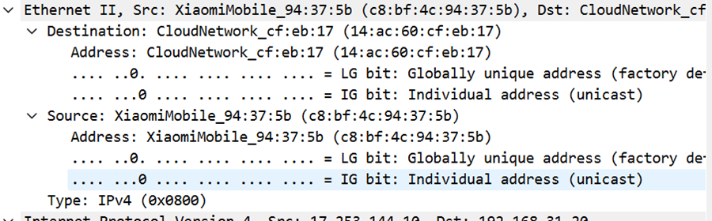
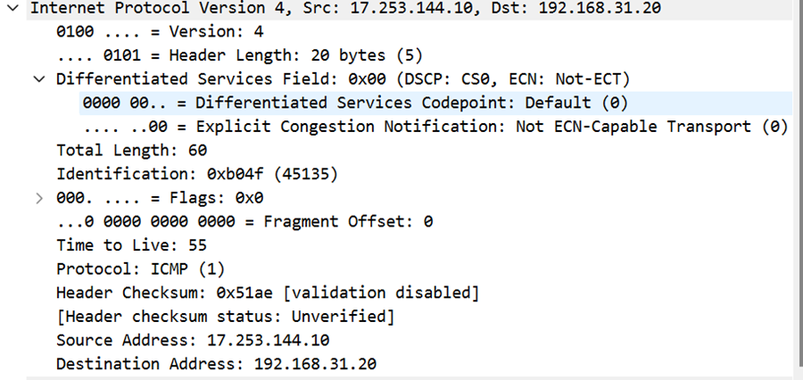
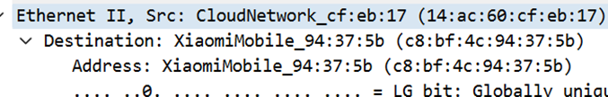
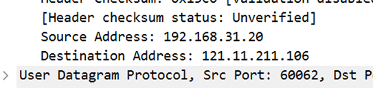
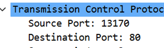
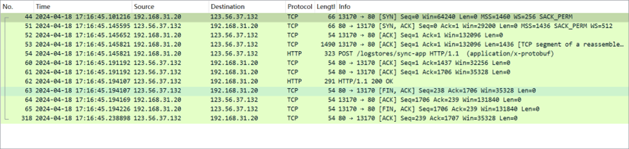
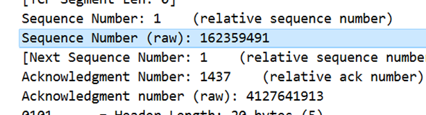
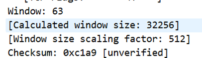
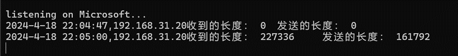
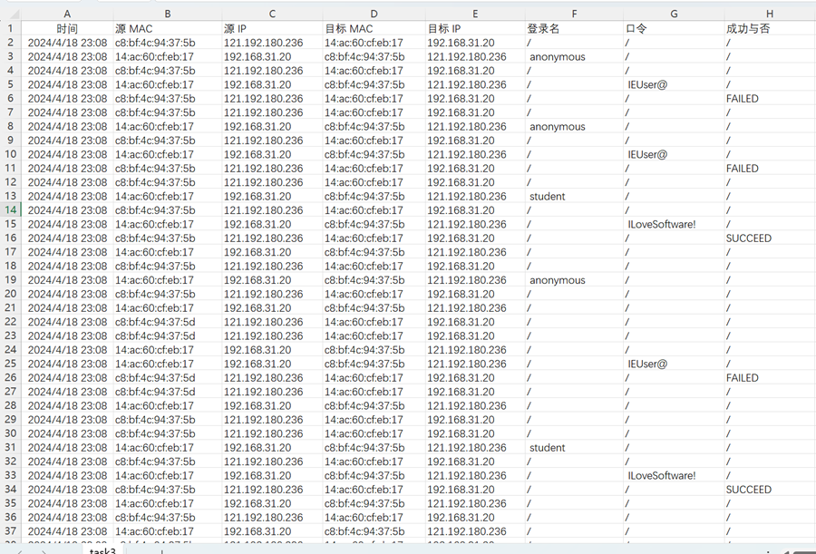

# School of Information Science and Engineering, Department of Software Engineering, "Computer Networks" Experiment Report

- Title: Experiment Three - Listening to and Analyzing Network Traffic Based on PCAP Library
- Class: Excellent Class of Software Engineering, 2021
- Name: Wang Minghao
- Student ID: 37220222203769
- Experiment Date: April 18, 2024

> Filling Instructions
> 
> 1. This document is a Word template file. It is recommended to open it using Microsoft Word 2021 and fill in the available areas truthfully.
> 
> 2. Do not change the font or font size while filling out the form. Maintain a neat layout. Submit the printed document as a PDF file.
> 
> 3. Try to keep the total size of the file below 1MB, and do not exceed 5MB at maximum.
> 
> 4. The materials list should be uploaded to a code hosting platform.
> 
> 5. Within 14 days after the end of the laboratory session, send the original file to the designated location on the course FTP.

## 1. Objective
Through the completion of the experiment, to understand the basic principles of the data link layer, network layer, transport layer, and application layer. Master the observation of network traffic using Wireshark and assist in network monitoring-related programming; master the method of listening to and processing Ethernet frames and IP packets using Libpcap or WinPcap libraries; familiarize with the concepts of Ethernet frames, IP packets, TCP segments, and FTP commands, and understand the basic mechanism of the TCP protocol; familiarize with the meanings of various fields in frame headers or IP packet headers. Familiarize with the concepts of TCP segments and FTP data protocols, and understand the meanings of various fields in segment headers and FTP control commands.

## 2. Experimental Environment
Operating System: Windows 11

Software Used: Wireshark 4.2.4

Programming Language, etc.

## 3. Experimental Results
#### Task01: Observing Data Formats Using Wireshark or Omnipeek
Using Wireshark or Omnipeek and other network monitoring software to observe data streams on the network, verifying the nesting of network protocol layers taught in theory classes.
 
##### Frame Format Verification
Comprising Source Address, Destination Address, and Data Type
 
##### IP Packet Format

Version: 4

Header Length: 20 bytes

Differentiated Services Field

Total Length: 60

Identification: 0xb04f

Flags: 0

Fragment Offset: 0

Time to Live: 55

Upper Layer Protocol: ICMP

Header Checksum: 0x51ae

Source Address: 17.253.144.10

Destination Address: 192.168.31.20

 
##### TCP Segment Format
1. Source Port: 7472, indicating the source port number of the segment.
2. Destination Port: 80, representing the destination port number of the segment, typically used for HTTP.
3. Stream index: 21, a stream index possibly used for identifying a specific stream.
4. Conversation completeness: Complete, WITH_DATA (31), indicating a complete conversation with data.
5. TCP Segment Len: 0, the length of the TCP segment is 0, indicating no payload data.
6. Sequence Number: 1606 (relative sequence number), representing the relative sequence number 1606 used for sequencing packets.
7. Sequence Number (raw): 1773162051, the raw sequence number represented in bytes.
8. Next Sequence Number: 1606 (relative sequence number), the next expected sequence number.
9. Acknowledgment Number: 239 (relative ack number), representing the acknowledgment number, i.e., the next expected sequence number to be received.
10. Acknowledgment number (raw): 31633723850101, the raw acknowledgment number.
11. Header Length: 20 bytes (5), indicating the header length of 20 bytes.
12. Flags: Ox010 (ACK), flag: ACK, indicating this is an acknowledgment segment.
13. Window: 515, the window size is 515 bytes, used for flow control.
14. Calculated window size: 131840, the calculated window size.
15. Window size scaling factor: 256, the scaling factor for window size.
16. Checksum: 0x4be2 [unverified], the checksum used to check if the segment has been corrupted during transmission.
17. Checksum Status: Unverified, indicating the status of the checksum is unverified.
18. Urgent Pointer: 0, the urgent pointer indicating the position of urgent data.
19. Timestamps, timestamps possibly used for measuring transmission delay, etc.
20. SEQ/ACK analysis, analysis of sequence and acknowledgment numbers.

 
##### FTP Protocol Command and Response Formats
 
##### Validating MAC Address
 
##### Validating IP Address
 
##### Validate TCP port and other protocol address formats
 
#### Task02: Observing TCP Mechanisms Using Packet Sniffing Software

Use Wireshark to listen and observe TCP segments.
Examine the process of establishing and terminating connections, observing segment IDs, window mechanisms, and congestion control mechanisms. Include screenshots of these processes in the report.
Below is the process of establishing and terminating connections:
 
Initially, the TCP mechanism establishes a connection using a three-way handshake (the client initiates a connection request (SYN), the server acknowledges the connection request (SYN-ACK), and the client confirms the connection (ACK)).

Segment ID: Each TCP segment has a unique sequence number.

 

Window Mechanism: During the establishment of a TCP connection, the sender and receiver negotiate a window size. The window size indicates the amount of data the receiver is willing to accept, and the sender bases data transmission on this window size.

 

Congestion Control Mechanism: TCP uses a series of algorithms to adjust the data transmission rate to avoid network congestion and data loss.

  

#### Task03 Monitoring Network Data Using the Libpcap or WinPcap Library
Key Portions of the Code:

Monitoring with WinPcap:

`pcap_loop(adhandle, 0, packet_handler, NULL);`

Capture the Packet Header:

```
ih = (ip_header*)(pkt_data +
	14); //length of ethernet header

mh = (mac_header*)(pkt_data);

/* retireve the position of the udp header */
ip_len = (ih->ver_ihl & 0xf) * 4;
uh = (udp_header*)((u_char*)ih + ip_len);
```

The network data captured using the WinPcap library is as follows:

 

Conducting Statistics:

 

#### Task04 Analyzing Captured Network Data

Implement the core code to extract usernames and passwords from the data:

```
if (*data == 'U' && *(++data) == 'S' && *(++data) == 'E' && *(++data) == 'R') {
	while (*(++data) != 0x0d)  string[i++] = *data;
	string[i] = '\0';
	fprintf(out,"%s,/,/\n", string);
	return;
}

data = (char*)(pkt_data + 54);
if (*data == 'P' && *(++data) == 'A' && *(++data) == 'S' && *(++data) == 'S') {
	while (*(++data) != 0x0d)  string[i++] = *data;
	string[i] = '\0';
	fprintf(out, "/,%s,/\n", string);
	return;
}

data = (char*)(pkt_data + 54);
if (*data == '5' && *(++data) == '3' ) {
	fprintf(out, "/,/,FAILED\n");
	return;
}

data = (char*)(pkt_data + 54);
if (*data == '2' && *(++data) == '3') {
	fprintf(out, "/,/,SUCCEED\n");
	return;
}
fprintf(out, "/,/,/\n");
```

Execution Results：
 
## 4 Experimental Code
The code for this experiment has been uploaded to the following code repository: https://gitee.com/carribia/cn_exp03

## 5 Experiment Summary
Through this experiment, I have gained a deeper understanding of the various protocols and their formats across different layers of computer networking, and I have come to understand the functions of different parts of file headers. Additionally, I have thoroughly studied the data format of the FTP protocol and mastered the presentation forms of usernames and passwords. This not only reviews the content learned earlier but also lays a solid foundation for future studies.
