# 信息学院软件工程系《计算机网络》实验报告

- 题　　目 	：实验三　基于 PCAP 库侦听并分析网络流量	
- 班　　级 	：软件工程2021级卓越班	
- 姓　　名 	：王明皓	
- 学　　号 	：37220222203769	
- 实验时间 	：2024年4月18日	


> 填写说明
> 
> 1、本文件为Word模板文件，建议使用Microsoft Word 2021打开，在可填写的区域中如实填写；
> 
> 2、填表时勿改变字体字号，保持排版工整，打印为PDF文件提交；
> 
> 3、文件总大小尽量控制在1MB以下，最大勿超过5MB；
> 
> 4、应将材料清单上传在代码托管平台上；
> 
> 5、在实验课结束14天内，按原文件发送至课程FTP指定位置。
 
## 1 实验目的
通过完成实验，理解数据链路层、网络层、传输层和应用层的基本原理。掌握用 Wireshark 观察网络流量并辅助网络侦听相关的编程；掌握用 Libpcap 或 WinPcap 库侦听并处理以太网帧和 IP 报文的方法；熟悉以太网帧、IP 报文、TCP 段和 FTP 命令的格式概念，掌握 TCP 协议的基本机制；熟悉帧头部或 IP 报文头 部各字段的含义。熟悉 TCP 段和 FTP 数据协议的概念，熟悉段头部各字段和 FTP 控制命令的指令和数据的含义。
## 2 实验环境
操作系统：Windows11

使用软件：Wireshark4.2.4

编程语言等。
## 3 实验结果
#### Task01 用 Wireshark 或 Omnipeek 侦听解析软件观察数据格式
用 Wireshark 或 Omnipeek 等网络侦听软件网络上的数据流，验证理论课讲授的网络协议层次嵌套

 

##### 验证帧格式
由源地址、目的地址、数据类型组成

 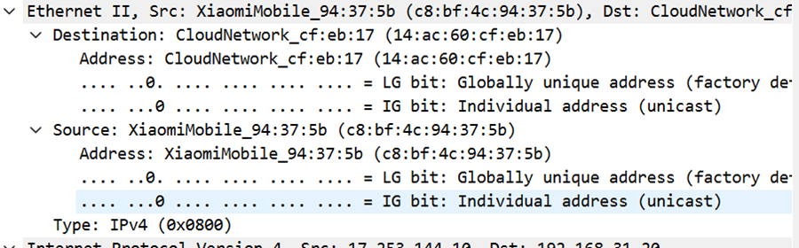

##### IP 报文格式

版本号：4

头文件长度：20 bytes

区分服务字段

总长度：60

标识：0xb04f

标志：0

偏移量：0

生存时间：55

上层协议：ICMP

头文件校验和：0x51ae

源地址：17.253.144.10

目的地址：192.168.31.20

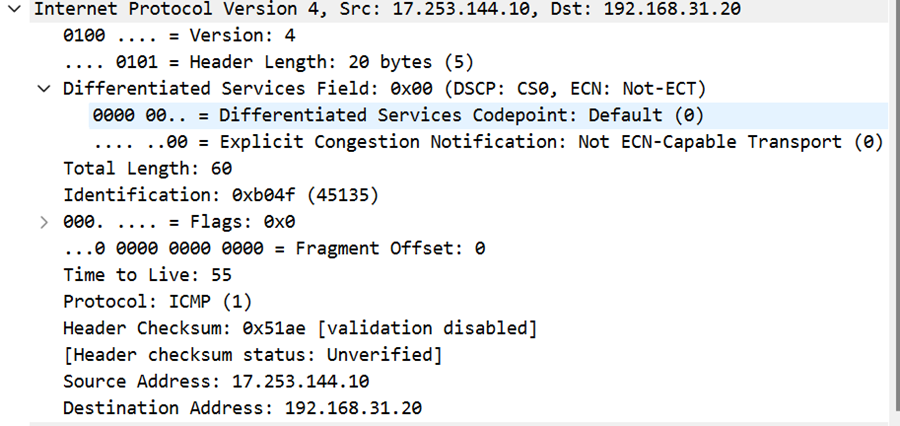
 
##### TCP 段格式
1.	源端口 Source Port: 7472，表示报文的来源端口号。
2.	目的端口 Destination Port: 80
，表示报文的目的端口号，这里是80端口，通常用于 HTTP。
3.	Stream index: 21
，流索引，可能是用于识别某个流的编号。
4.	Conversation completeness: Complete, WITH_DATA (31)
，对话完成度，完整的对话，并且包含数据。
5.	TCP Segment Len: 0
，TCP 段的长度为0，即没有有效载荷数据。
6.	Sequence Number: 1606 (relative sequence number)
，表示相对序列号为1606，用于数据包的顺序重组。
7.	Sequence Number (raw): 1773162051
，原始序列号，以字节表示。
8.	Next Sequence Number: 1606 (relative sequence number)
，下一个期望的序列号。
9.	Acknowledgment Number: 239 (relative ack number)
，表示确认号，即期望收到的下一个序列号。
10.	Acknowledgment number (raw): 31633723850101
，原始确认号。
11.	Header Length: 20 bytes (5)
，报头长度为20字节。
12.	Flags: Ox010 (ACK)
，标志位：ACK，表示这是一个确认报文。
13.	Window: 515
，窗口大小为515字节，用于流量控制。
14.	Calculated window size: 131840
，计算得到的窗口大小。
15.	Window size scaling factor: 256
，窗口大小的缩放因子。
16.	Checksum: 0x4be2 [unverified]
，校验和，用于检查数据包在传输过程中是否被损坏。
17.	Checksum Status: Unverified
，校验和的状态是未验证的。
18.	Urgent Pointer: 0
，紧急指针，用于指示紧急数据的位置。
19.	Timestamps
，时间戳，可能用于测量报文的传输延迟等。
20.	SEQ/ACK analysis
，序列号和确认号的分析。
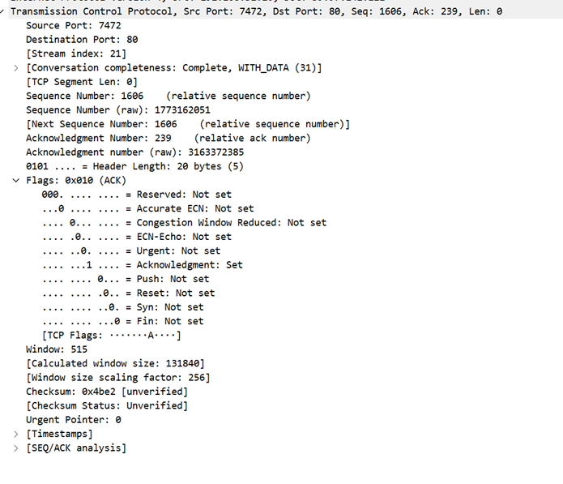
 
##### FTP 协议命令和响应的格式

 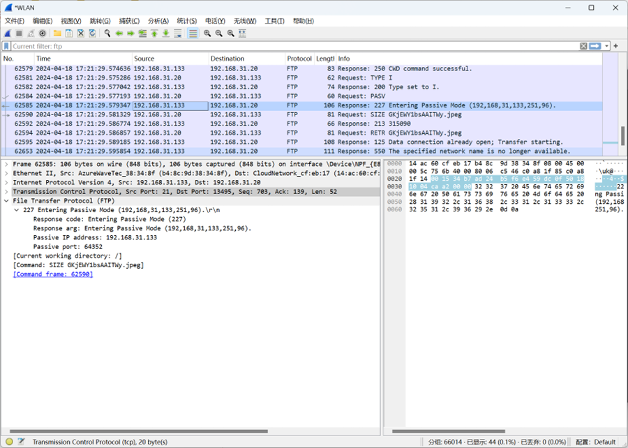

##### 验证 MAC 地址

 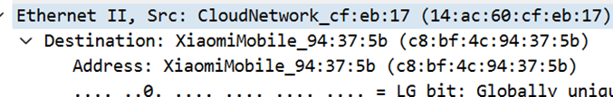

##### 验证IP 地址

 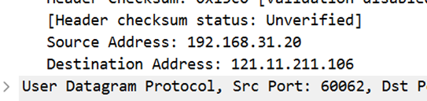

##### 验证TCP 端口等协议地址格式 

 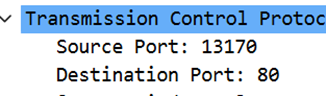

#### Task02 用侦听解析软件观察 TCP 机制 
用 Wireshark 侦听并观察 TCP 数据段。
观察其建立和撤除连接的过程，观察段 ID、窗口机制和拥塞控制机制等。将该过程截图在报告中。 
以下为其建立连接和撤出连接的过程：

 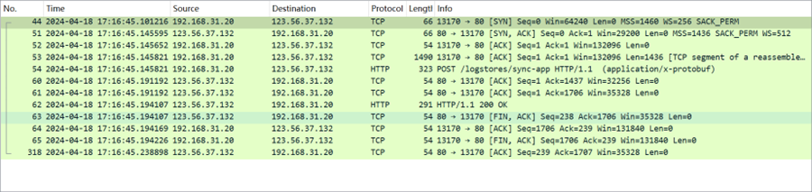

首先TCP机制会利用三次握手（客户端发起连接请求（SYN）、服务器确认连接请求（SYN-ACK）、客户端确认连接（ACK））来建立连接

段ID：每个TCP段都有唯一的序列号
 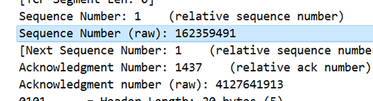
窗口机制：在TCP连接建立时，发送方和接收方会协商一个窗口大小。窗口大小表示接收方愿意接受的数据量，发送方根据这个窗口大小来发送数据。

 

拥塞控制机制：TCP通过一系列的算法来调整数据发送速率，以避免网络拥塞和数据丢失

  

#### Task03 用 Libpcap 或 WinPcap 库侦听网络数据
部分关键代码：

利用WinPcap进行监听：

`pcap_loop(adhandle, 0, packet_handler, NULL);`

获取报文头：

```
ih = (ip_header*)(pkt_data +
	14); //length of ethernet header

mh = (mac_header*)(pkt_data);

/* retireve the position of the udp header */
ip_len = (ih->ver_ihl & 0xf) * 4;
uh = (udp_header*)((u_char*)ih + ip_len);
```

利用WinPcap库侦听到的网络数据如下：

 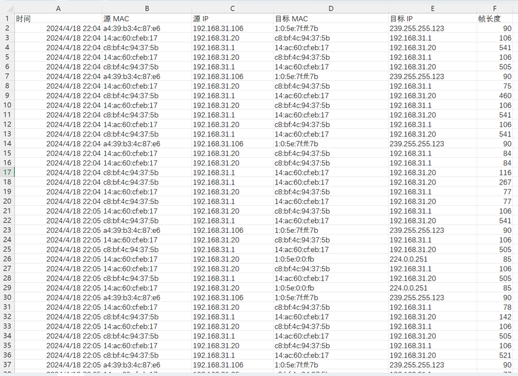

进行统计：

 

#### Task04 解析侦听到的网络数据
实现从数据中提取用户名密码的核心代码：

```
if (*data == 'U' && *(++data) == 'S' && *(++data) == 'E' && *(++data) == 'R') {
	while (*(++data) != 0x0d)  string[i++] = *data;
	string[i] = '\0';
	fprintf(out,"%s,/,/\n", string);
	return;
}

data = (char*)(pkt_data + 54);
if (*data == 'P' && *(++data) == 'A' && *(++data) == 'S' && *(++data) == 'S') {
	while (*(++data) != 0x0d)  string[i++] = *data;
	string[i] = '\0';
	fprintf(out, "/,%s,/\n", string);
	return;
}

data = (char*)(pkt_data + 54);
if (*data == '5' && *(++data) == '3' ) {
	fprintf(out, "/,/,FAILED\n");
	return;
}

data = (char*)(pkt_data + 54);
if (*data == '2' && *(++data) == '3') {
	fprintf(out, "/,/,SUCCEED\n");
	return;
}
fprintf(out, "/,/,/\n");
```

运行结果：

 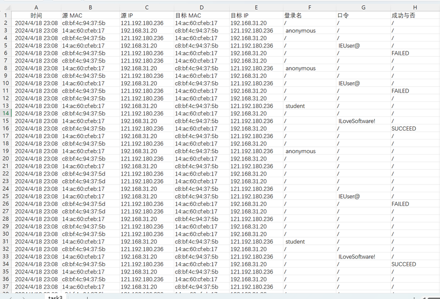

## 4 实验代码
本次实验的代码已上传于以下代码仓库：https://gitee.com/carribia/cn_exp03
## 5	实验总结
通过本次实验，我对于计算机网络各分层的相关协议和其格式有了更深刻的理解，明白了文件头不同部位的作用。同时，深入研究了FTP协议的数据格式，掌握了其用户名和密码的呈现形式。这既是对前期学到的内容的回顾，又为未来的学习打下了坚定的基础。
